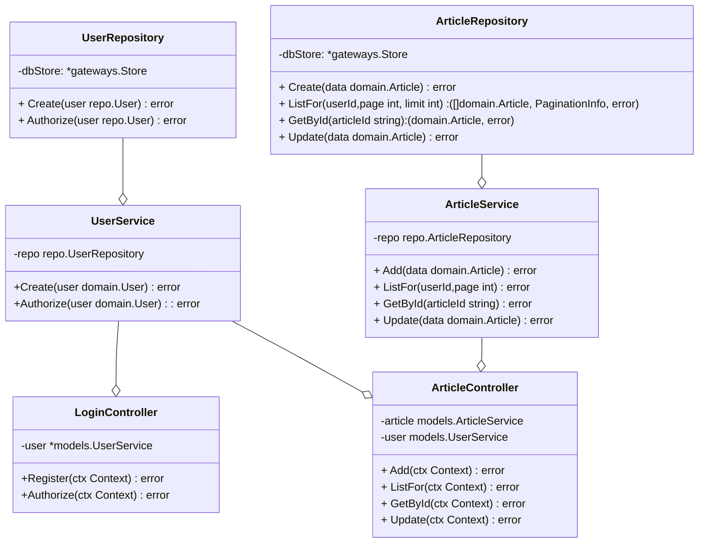
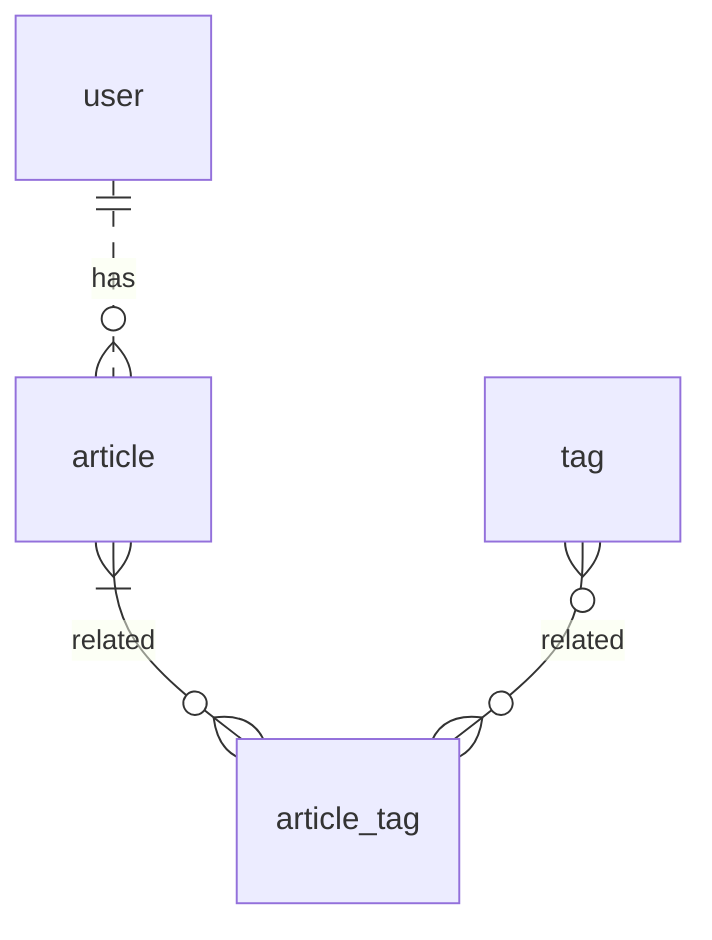

## Business diagram

```mermaid
classDiagram
    UserService --o LoginController
    UserRepository --o UserService

    class LoginController{
      -user *models.UserService
      +Register(ctx Context) error
      +Authorize(ctx Context) error
    }
    class UserService{
      -repo repo.UserRepository
      +Create(user domain.User) error
      +Authorize(user domain.User): error
    }
    class UserRepository{
      -dbStore: *gateways.Store
      + Create(user repo.User) error
      + Authorize(user repo.User) error
    }


    ArticleService --o ArticleController
    UserService --o ArticleController
    ArticleRepository --o ArticleService
    class ArticleController{
      -article models.ArticleService
      -user models.UserService
      + Add(ctx Context) error
      + ListFor(ctx Context) error
      + GetById(ctx Context) error
      + Update(ctx Context) error
    }
    class ArticleService{
      -repo repo.ArticleRepository
      + Add(data domain.Article) error
      + ListFor(userId,page int) error
      + GetById(articleId string)  error
      + Update(data domain.Article) error
    }
    class ArticleRepository{
        -dbStore: *gateways.Store
      + Create(data domain.Article) error
      + ListFor(userId,page int, limit int) : ([]domain.Article, PaginationInfo, error)
      + GetById(articleId string): (domain.Article, error)
      + Update(data domain.Article) error
    }

```

## ER diagram

```mermaid
erDiagram
    user  ||..o{ article : has
    article }|--o{ article_tag : related
    tag }o--o{ article_tag : related
```
