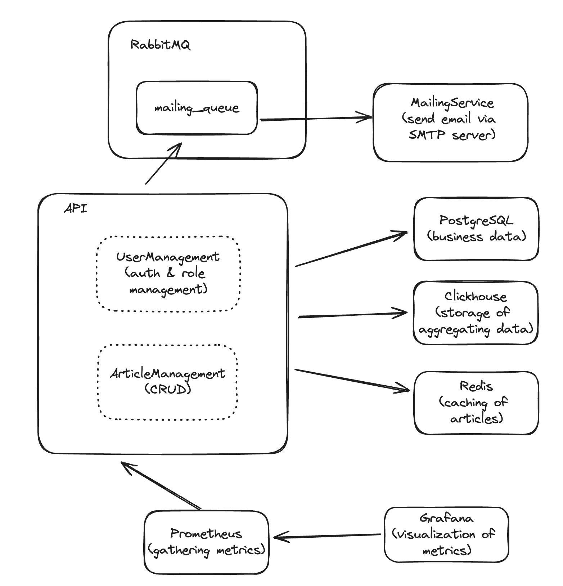
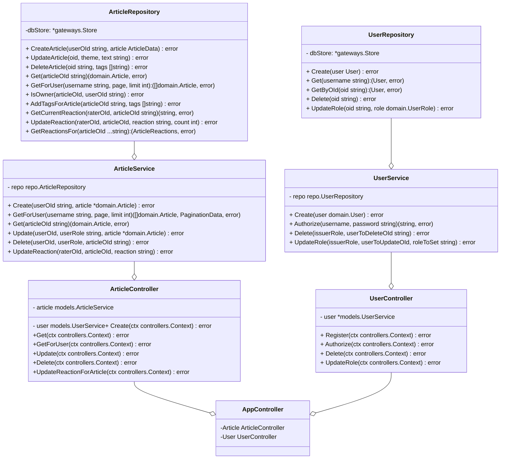
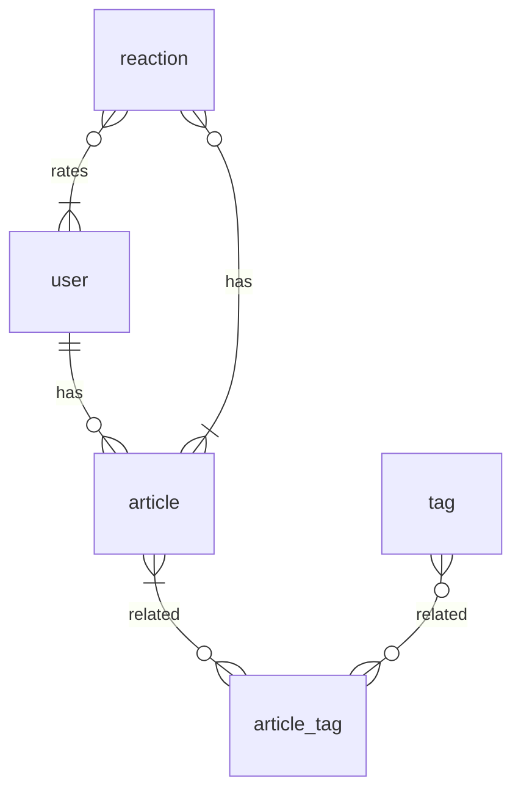

## Infrustructure

## Business diagram

```mermaid
classDiagram
  UserService --o UserController
  UserRepository --o UserService

  class UserController{
      - user *models.UserService
      + Register(ctx controllers.Context) error
      + Authorize(ctx controllers.Context) error
      + Delete(ctx controllers.Context) error
      + UpdateRole(ctx controllers.Context) error
  }
  class UserService{
      - repo repo.UserRepository
      + Create(user domain.User) error
      + Authorize(username, password string) (string, error)
      + Delete(issuerRole, userToDeleteOId string) error
      + UpdateRole(issuerRole, userToUpdateOId, roleToSet string) error
  }
  class UserRepository{
      - dbStore: *gateways.Store
      + Create(user User) error
      + Get(username string): (User, error)
      + GetByOId(oid string): (User, error)
      + Delete(oid string) error
      + UpdateRole(oid string, role domain.UserRole) error
  }


  ArticleService --o ArticleController
  ArticleRepository --o ArticleService
  class ArticleController{
      - article models.ArticleService
      - user models.UserService+	Create(ctx controllers.Context) error
      +	Get(ctx controllers.Context) error
      +	GetForUser(ctx controllers.Context) error
      +	Update(ctx controllers.Context) error
      +	Delete(ctx controllers.Context) error
      +	UpdateReactionForArticle(ctx controllers.Context) error
  }
  class ArticleService{
      - repo repo.ArticleRepository
      + Create(userOId string, article *domain.Article) error
      + GetForUser(username string, page, limit int) ([]domain.Article, PaginationData, error)
      + Get(articleOId string) (domain.Article, error)
      + Update(userOId, userRole string, article *domain.Article) error
      + Delete(userOId, userRole, articleOId string) error
	    + UpdateReaction(raterOId, articleOId, reaction string) error
  }
  class ArticleRepository{
      -dbStore: *gateways.Store
      + CreateArticle(userOId string, article ArticleData) error
      + UpdateArticle(oid, theme, text string) error
      + DeleteArticle(oid string, tags []string) error
      + Get(articleOId string) (domain.Article, error)
      + GetForUser(username string, page, limit int): ([]domain.Article, error)
      + IsOwner(articleOId, userOId string) error
      + AddTagsForArticle(articleOId string, tags []string) error

      + GetCurrentReaction(raterOId, articleOId string) (string, error)
      + UpdateReaction(raterOId, articleOId, reaction string, count int) error
      + GetReactionsFor(articleOId ...string): (ArticleReactions, error)
  }


  ArticleController --o AppController
  UserController --o AppController
    class AppController{
    -Article ArticleController
    -User UserController
  }
```

## ER diagram

```mermaid
erDiagram
  user  ||--o{ article : has
  article }|--o{ article_tag : related
  tag }o--o{ article_tag : related
  reaction }o--|{ article : has
  reaction }o--|{ user : rates

```
